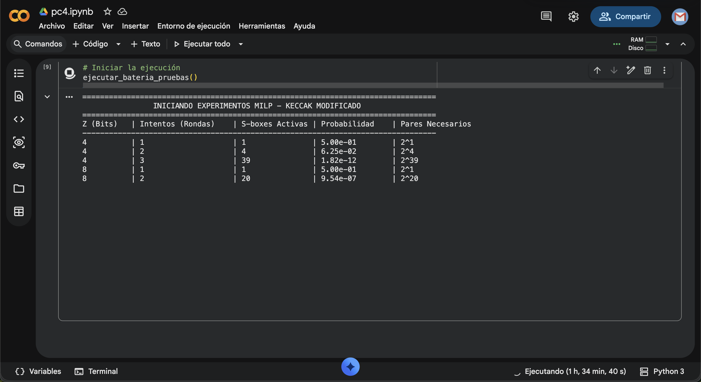

::: IEEEkeywords
Keccak, SHA-3, MILP, Criptoanálisis Diferencial , S-box activas.
:::

# Introducción

El estándar de hash SHA-3 está basado en la familia de funciones esponja
Keccak\[cite: 1\]. La fortaleza de Keccak contra ataques diferenciales
recae en la iteración de múltiples rondas matemáticas que difunden y
confunden los bits del estado original el step mapping que le da su no
linealidad es el chi justamente donde se realizaran los mayores cambiso.
El estado en Keccak se representa como un arreglo tridimensional de
$5 \times 5 \times w$ bits (donde w variara de acuerdo a los bits
ingresados en nuestro caso z=4 y z = 8).

En este trabajo se propone y analiza una modificación estructural al
algoritmo original: la inclusión de una variable dinámica denominada
"Intentos", la cual controla directamente el número de rondas que se
aplican al mensaje, si un atacante realiza muchos ataques el nuevo de
rondas aumentara , pero para la parte experimenta mantendremos constante
las variables excepto el numero de rondas para comparar el cambio que se
realiza entre cada iteracion.

Para auditar la seguridad de esta variante, se plantea como objetivo
encontrar el número mínimo de Cajas de Sustitución (S-boxes) activas
utilizando Programación Lineal Entera Mixta (MILP) mediante la libreria
pulp para facilitar calculos. Una S-box activa implica que una
diferencia introducida por un atacante ha cruzado la capa no lineal del
algoritmo(la $\chi$ paso). Minimizar este valor permite encontrar la
trayectoria diferencial más vulnerable del sistema.

## Parte Práctica

La implementación en código de este modelo matemático y la ejecución de
los experimentos descritos pueden ser visualizados en Google Colab. Se
puede acceder al cuaderno en el siguiente enlace(esta es una
modificacion de la plantilla que brindo el profesor):\
<https://colab.research.google.com/drive/1KbPl4fVSjuJZT59P6-TQivEfTsG5tiM9#scrollTo=-iVfTxx56GT6>

# Descripción del Algoritmo Modificado

La operación estándar de una permutación Keccak-p consta de un número
predeterminado y fijo de rondas(generamelmente 24). se presntara asi:

    KeccakModificado(Mensaje, Intentos):
      Estado = Absorber(Mensaje) 
      Para r desde 0 hasta Intentos - 1:
          Estado = Theta(Estado)
          Estado = Rho(Estado)
          Estado = Pi(Estado)
          Estado = Chi(Estado)
          Estado = Iota(Estado, r)
      Retornar Exprimir(Estado)

La permutación interna aplica secuencialmente los cinco pasos descritos:
$\theta, \rho, \pi, \chi, \iota$\[cite: 1\]. La seguridad del algoritmo
dependerá enteramente de cuán grande sea el valor de la variable
*Intentos* (yo considere este numero constante para facilitar la
obtension de los resultados finales y solo trabaje con el numero de
rondas).

# Modelo MILP

Para rastrear la propagación de diferencias bit a bit, se emplean
variables binarias $A[x,y,z] \in \{0,1\}$, donde $1$ indica una
diferencia activa y $0$ la ausencia de ella.

## Restricciones Lineales para $\theta, \rho, \pi$

Los pasos $\theta, \rho, \pi$ consisten en operaciones XOR y
permutaciones espaciales (es la parte lineal del codigo 1.El theta varia
una columan de acuerdo a sus hermanas , el rho mantine un carril
constante mientras varia los demas y el pi , dentro de un lamina rota
los elementos aumentando su difusion). La operación $c = a \oplus b$ se
linealiza mediante las siguientes cuatro restricciones de desigualdad:
$$\begin{align}
    a + b + c &\le 2 \\
    a + b - c &\ge 0 \\
    a - b + c &\ge 0 \\
    -a + b + c &\ge 0
\end{align}$$

## Linealización de $\chi$ con Variables AND

El paso $\chi$ es la única operación no lineal(la parte mas crucial
diria yo), actuando sobre filas de 5 bits a la vez. Su definición
incluye una compuerta lógica AND (multiplicación). Para modelar
$c = a \text{ AND } b$ sin violar la linealidad del MILP, introducimos
variables auxiliares con las siguientes restricciones: $$\begin{align}
    c &\le a \\
    c &\le b \\
    c &\ge a + b - 1
\end{align}$$

Una S-box (fila de 5 bits) se considera *activa* ($S_{activa} = 1$) si
cualquier de sus bits de entrada posee una diferencia. Esto se restringe
como: $$\begin{equation}
    S_{activa} \le \sum_{i=0}^{4} x_i, \quad S_{activa} \ge x_i \text{ } \forall i \in \{0..4\}
\end{equation}$$ Además, por las propiedades biyectivas de la
permutación, se fuerza a que la suma de las diferencias de salida sea al
menos $S_{activa}$.(esto nos permite saber la seguridad que tiene haber
realizado mas rondas)

## Función Objetivo

El solver debe encontrar el camino que minimice la cantidad total de
S-boxes activadas a lo largo de todas las rondas evaluadas:
$$\begin{equation}
    \text{Minimizar} \sum_{r=0}^{\text{Intentos}-1} \sum_{y=0}^{4} \sum_{z=0}^{w-1} \chi_{\text{active}_{r,y,z}}
\end{equation}$$

# Experimentos y Resultados: 

Se implementó el modelo MILP en Python, utilizando *PuLP* y el solver
*CBC*. Los experimentos se acotaron a tamaños de palabra pequeños
($z=4, 8$) para simular el comportamiento matemático sin agotar la
memoria computacional(igualemnte se fue muy pesado , para casos mas
grandes se deberia usar maquinas altamente potentes).

Asumiendo una probabilidad diferencial máxima de $P_{sbox} = 0.5$ (ya
que son 2 bits , en el mayor de los casos hay un medio de acertar
inicialmente) por cada S-box activa de 5 bits, el número de pares de
mensajes elegidos necesarios para un ataque se define como $2^N$, donde
$N$ es el mínimo de S-boxes activas. Los resultados se resumen en la
Tabla [\[tab:resultados\]](#tab:resultados){reference-type="ref"
reference="tab:resultados"}.(ya que la cantidad de s-boxes activas
refiere a la cantidad cambios activos que hubo se requiere 2 a este
numero de ataques para vulnerarlo)

<figure id="fig:resultados" data-latex-placement="htbp">

<figcaption>Ejecución y resultados de los experimentos(casi 2 horas
ejecutandose).</figcaption>
</figure>

# Conclusiones

La relación entre la variable "Intentos" y la seguridad del algoritmo es
estrictamente exponencial. Los experimentos demuestran que para un solo
intento ($r=1$), el ataque requiere apenas $2^1$ pares, haciendo al
sistema trivialmente vulnerable. Sin embargo, gracias al fenómeno de
avalancha impulsado por las capas de difusión, la cantidad de S-boxes
activas crece de forma abrupta a partir del tercer intento.

Delegar la seguridad a una variable dinámica es viable siempre que se
establezca un umbral mínimo estricto de iteraciones (generalmente
superior a 10 rondas para márgenes criptográficos modernos) para
garantizar que el número de pares de datos necesarios exceda los límites
computacionales y físicos de un atacante.

::: thebibliography
00 National Institute of Standards and Technology (NIST), "SHA-3
Standard: Permutation-Based Hash and Extendable-Output Functions," FIPS
PUB 202, Agosto 2015. IEEE, "IEEE Article Templates. links:
<https://www.ieee.org/conferences_events/conferences/publishing/templates.html>
:::
